# Dojo Manager

**Projeto PWA (Flutter/Dart) para gerenciamento completo de dojo (cadastro, financeiro e progresso).**

O **Dojo Manager** é uma aplicação moderna projetada para simplificar e automatizar as operações diárias de um dojo, oferecendo uma interface elegante e responsiva. Ele abrange desde a gestão de alunos e seus dossiês completos até o controle financeiro detalhado e o acompanhamento de progresso nas modalidades de artes marciais.

---

## 🔒 Arquitetura e Segurança

A segurança e a proteção de dados são os pilares fundamentais da arquitetura do Dojo Manager. O sistema foi construído desde o seu alicerce utilizando as melhores práticas do setor:

*   **Privacy by Design & Conformidade LGPD:** Garantimos a proteção de Dados Pessoais Identificáveis (PII). O sistema opera sob o princípio da minimização, garantindo que os dados armazenados sejam apenas aqueles estritamente necessários para o funcionamento. Dados sensíveis de saúde, financeiros e de contato são blindados contra exposição.
*   **Gestão Segura de Segredos:** Nossa arquitetura implementa **Zero Vazamentos**. Todas as chaves de API, strings de conexão e credenciais são isoladas em variáveis de ambiente ou Key Vaults. O código-fonte é higienizado de ponta a ponta: *nenhuma credencial existe em formato hardcode*.
*   **Controle Rigoroso de Acesso:** Proteção completa contra acessos não autorizados e ataques de referência direta a objetos (IDOR).
*   **Mascaramento em Logs:** Prevenção de vazamento acidental em depuração. Os logs do sistema não expõem PII.

---

## 🚀 Instruções de Instalação

Para configurar o ambiente de desenvolvimento local e rodar o Dojo Manager:

1.  **Clone o Repositório:**
    ```bash
    git clone https://github.com/st4anb/dojo_manager.git
    cd dojo_manager
    ```

2.  **Configuração de Variáveis de Ambiente:**
    *   Crie uma cópia do arquivo de exemplo para configurar suas variáveis.
    *   ```bash
        cp .env.example .env
        ```
    *   Edite o arquivo `.env` inserindo as credenciais corretas do Firebase e do Mercado Pago.
    *   *Lembrete de Segurança:* O arquivo `.env` jamais deve ser comitado. Nosso `.gitignore` já está configurado para blindá-lo.

3.  **Instalação das Dependências:**
    ```bash
    flutter pub get
    ```

4.  **Rodar a Aplicação (Ambiente Local):**
    *   Execute o PWA no Chrome ou Edge:
        ```bash
        flutter run -d chrome
        ```

---

### 🏗️ Arquitetura do Sistema (High-Level)
O Dojo Manager utiliza uma arquitetura baseada em nuvem, integrando o frontend Flutter com os serviços do Firebase e gateways de pagamento externos.

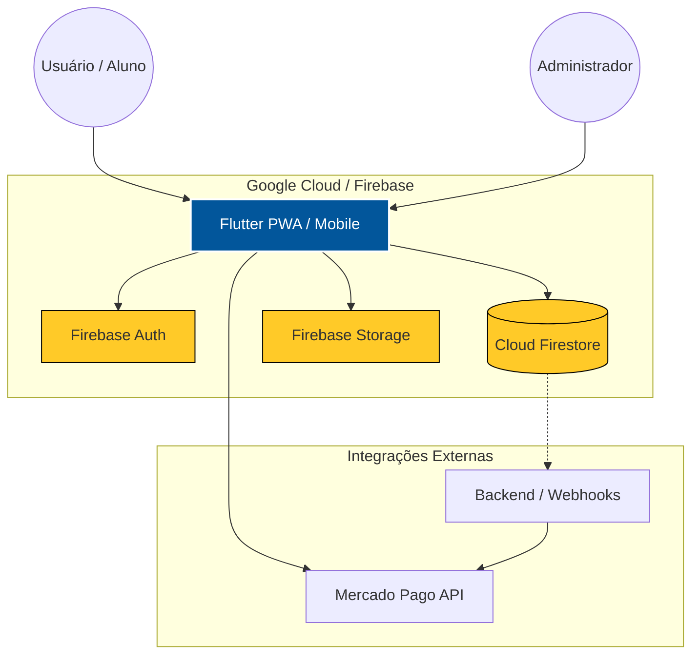

### 🔐 Fluxo de Autenticação e Segurança (Foco LGPD)
O acesso aos dados é protegido por camadas de autenticação JWT e Regras de Segurança no nível do banco de dados (Firestore Security Rules), garantindo que apenas o dono do dado ou administradores autorizados possam visualizar informações sensíveis.

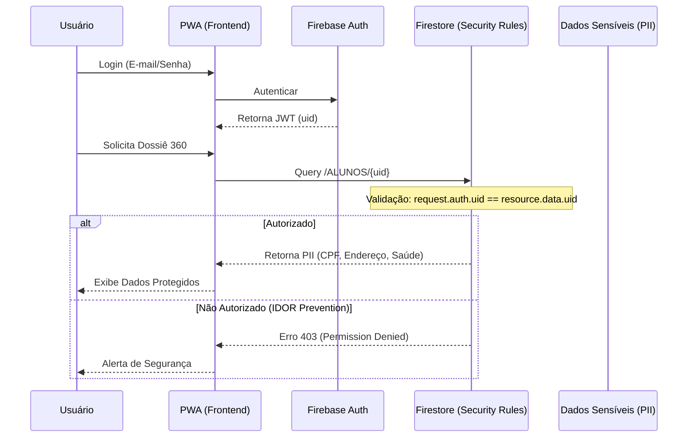

### 📊 Estrutura do Banco de Dados (Entidades)
Relacionamento entre as principais coleções do Firestore, centradas na entidade do Aluno.

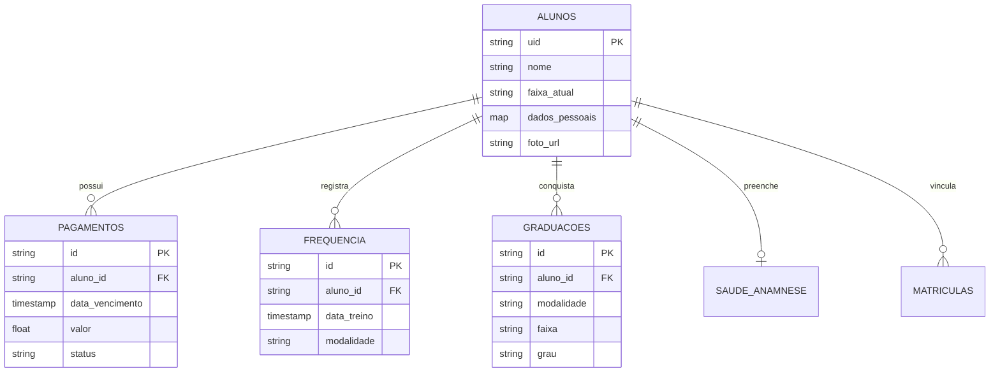

---

## 📸 Vitrine Visual Multiplataforma

O Dojo Manager foi desenhado com uma estética **Dark Premium** (Glassmorphism e Neumorphism) focada em alta performance e responsividade. Abaixo, apresentamos o mapeamento das telas e suas respectivas funções e proteções de segurança.

| Funcionalidade | Visão Web (Desktop) | Visão Mobile (PWA) |
| :--- | :---: | :---: |
| **Login Seguro** <br><br> Autenticação via `Firebase Auth`. Acesso protegido, onde o token JWT determina a visualização (Admin ou Aluno). | 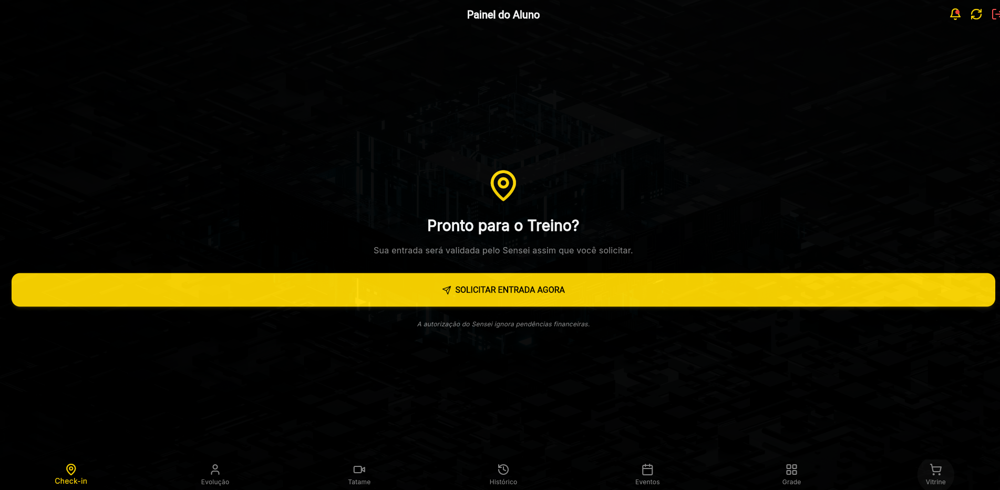 | 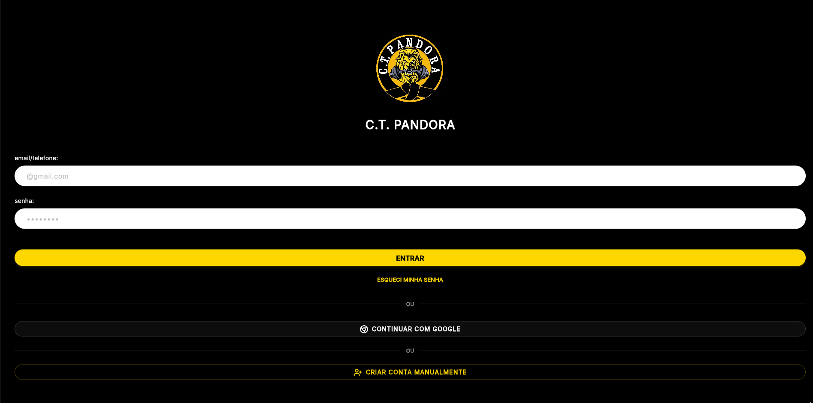 |
| **Dashboard Administrativo** <br><br> Visão geral do negócio. Dados cacheados. Proteção via *Firestore Rules* (`role == 'admin'`). | 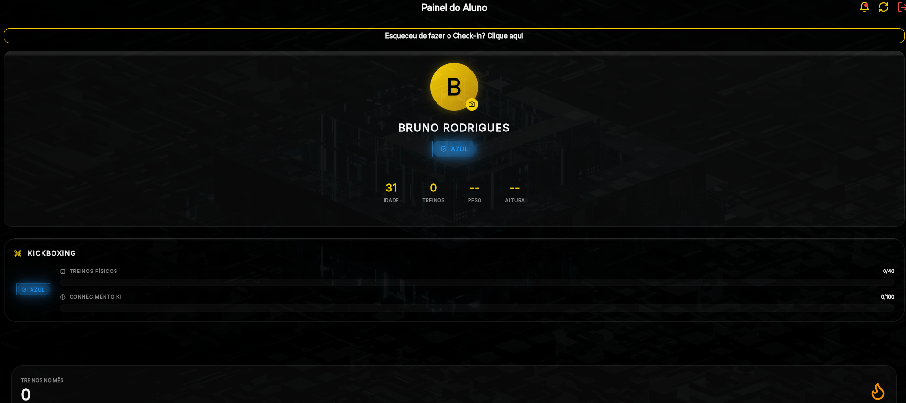 | 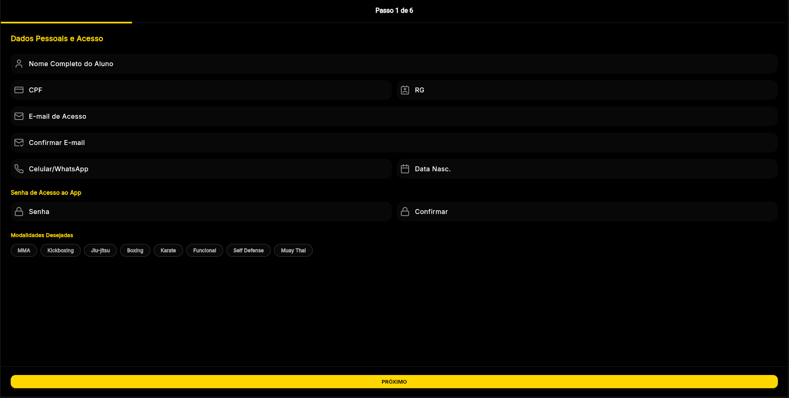 |
| **Grade de Horários** <br><br> Exibição dinâmica das modalidades. O Botão *Restaurar Grade* executa uma rotina backend (`DataSeeder`) para injetar os horários padrões sem corromper dados de alunos. | 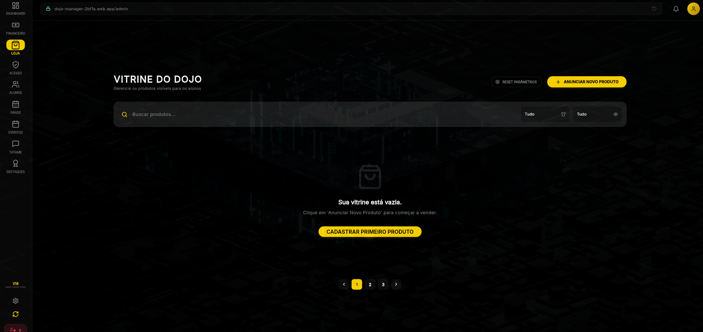 | 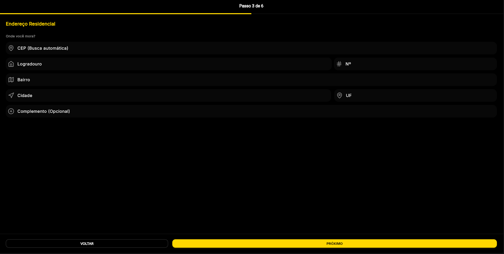 |
| **Dossiê do Aluno (360)** <br><br> Proteção LGPD estrita. O CPF e dados de saúde (*Anamnese*) são visíveis apenas para o próprio aluno ou administradores. Os formulários utilizam mascaramento de dados no frontend. |  | 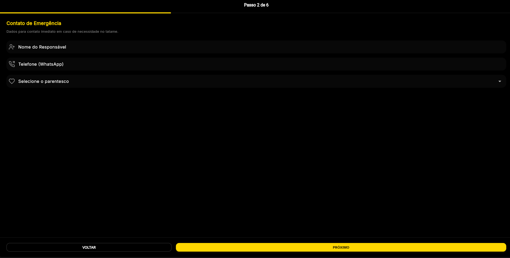 |
| **Portal do Aluno (Self-Service)** <br><br> Permite que o usuário consulte seu histórico, frequências e graduações ativas. Prevenção ativa contra IDOR (Referência Direta Insegura). | 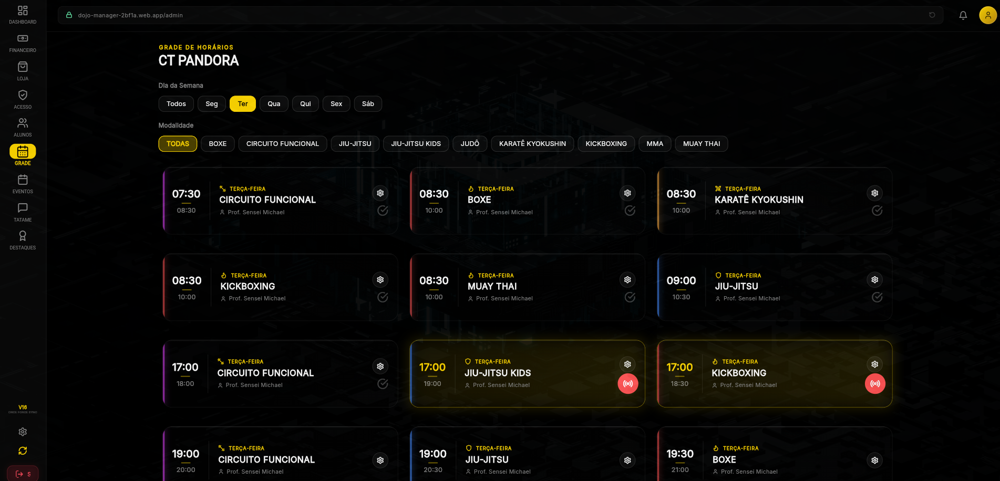 | 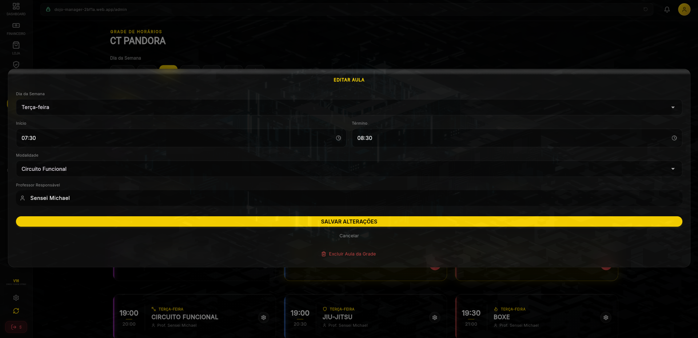 |
| **Gestão Financeira & Loja** <br><br> Relatórios financeiros mensais e loja virtual. Integração segura via Webhooks (Mercado Pago), sem armazenar dados de cartão de crédito no banco. | 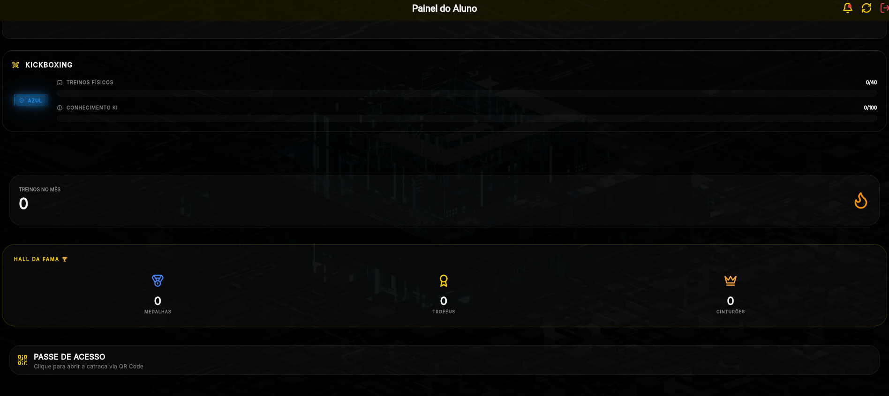 | 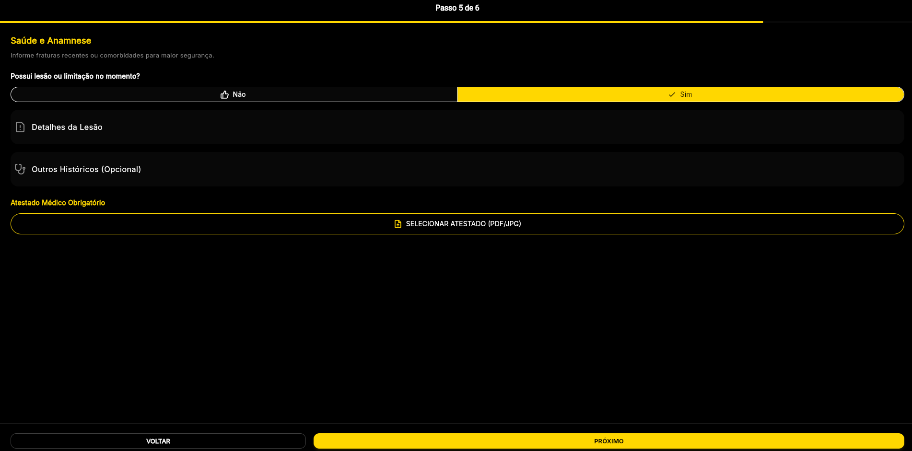 |

> *Nota: Todas as rotas de gravação e exclusão (botões de edição, exclusão e pagamentos) possuem validação dupla: no cliente (Flutter) e no servidor (Firestore Rules).*
